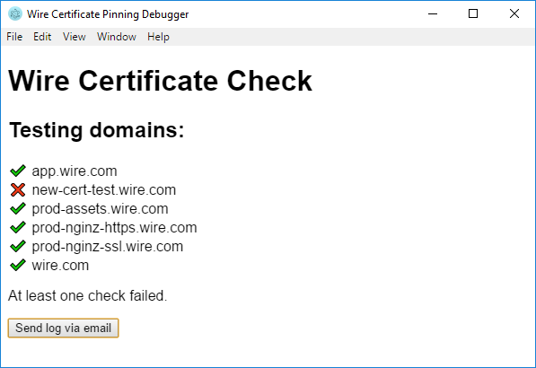

# Wire Certificate Pinning Debugger

## Screenshot



## Node.js usage

```bash
yarn
yarn start
```

## Additional terminal usage

There is a command-line interface to output the certificate fingerprint. It works like this:

```bash
node get_fingerprint.js --url https://app.wire.com
```
